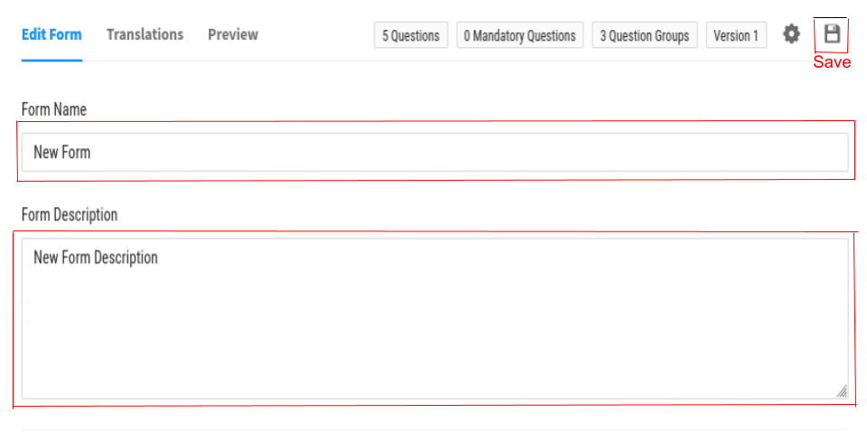
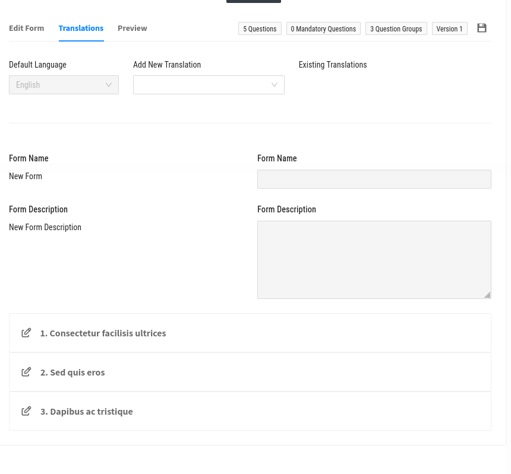
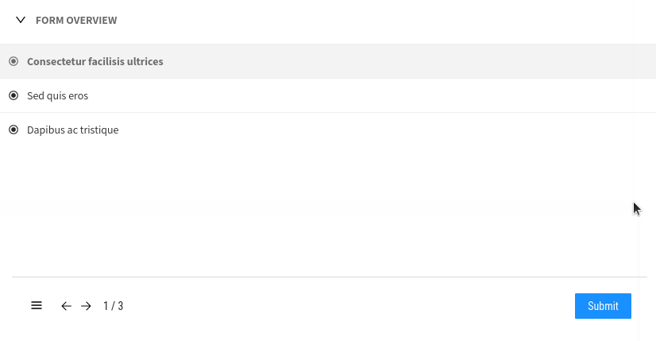
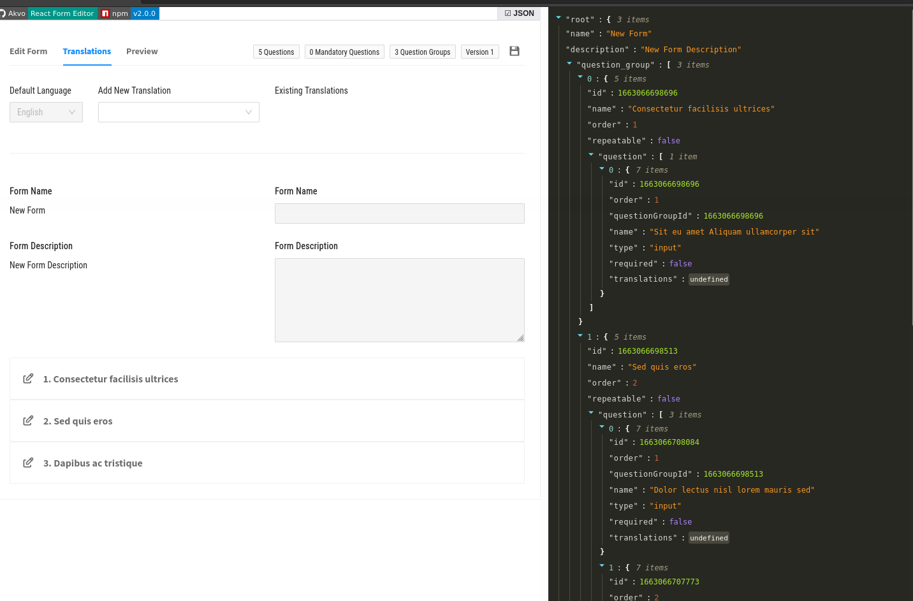

Form Features

Adding a new Form
-----------------

- Fill in the input **form name**
- Add a **form description** by fill a textarea
- Save your new Form

Translations
------------

You can add new language translations.

Preview
-------

Clicking on the **PREVIEW** button allows you to see a list of the new forms.
Form details can also be seen by clicking on an item(form)

JSON
----
Data as a JSON can be viewed by clickin on the **JSON** button

