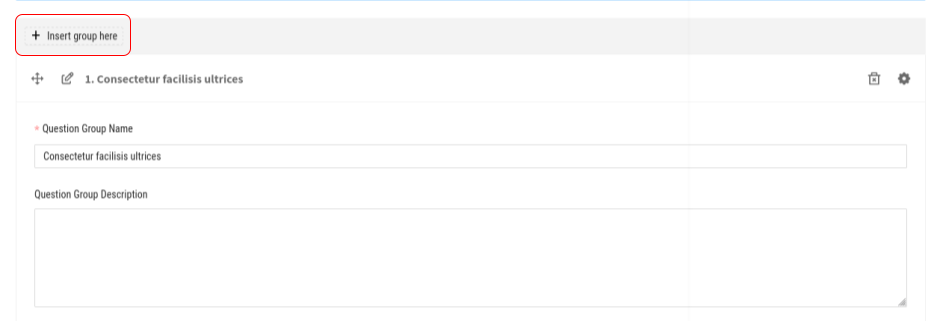
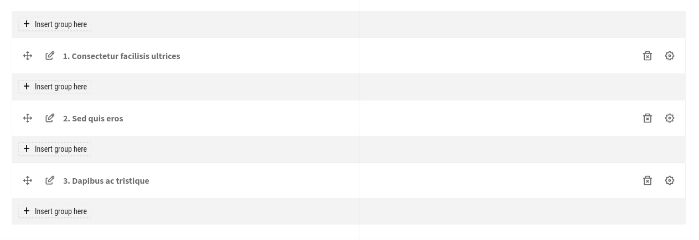
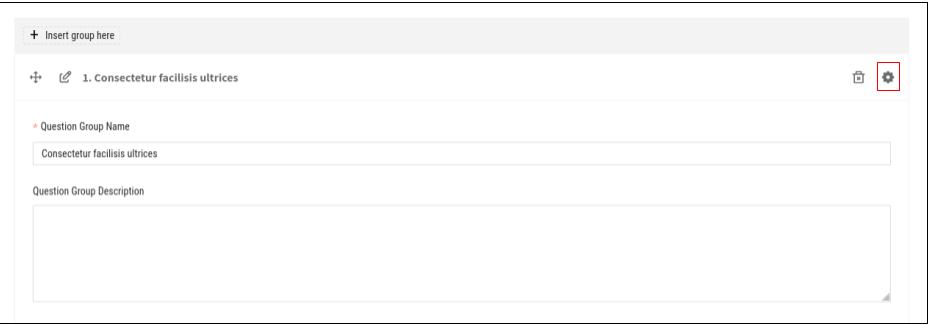
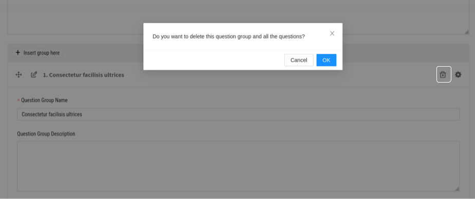

Question Group

Inserting a group
------------------

- Instead of manually creating a new form, a new form also can be added by clicking on the **INSERT GROUP** button. By doing this, forms with questions are grouped.

View
----

- The question group is ordered.
- A group can be viewed by hitting on the **view** icon.

Edit
----

Once you click on the **edit** icon, the group name and desciption are perfectly updatable.

Delete
------

A group can be deleted by clicking on the **trash** icon.

