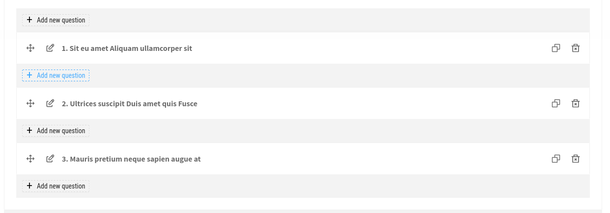
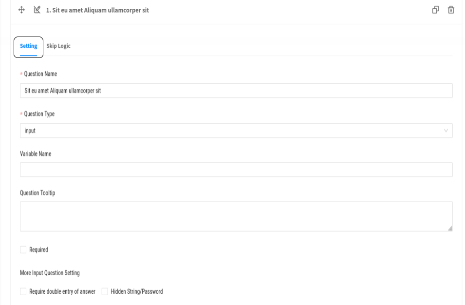
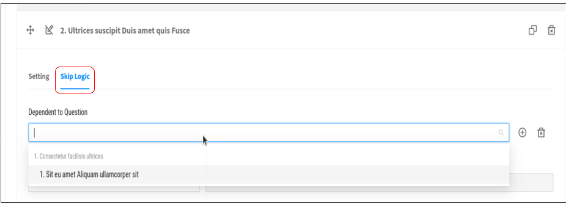
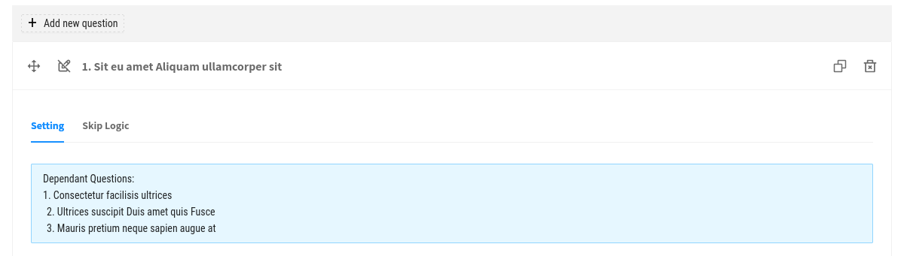
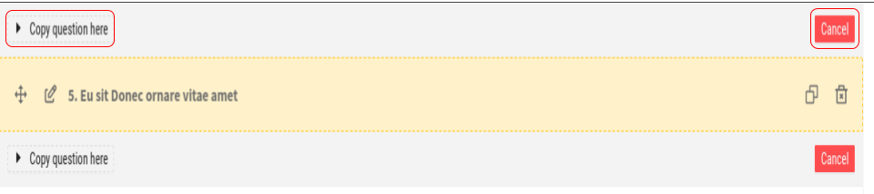
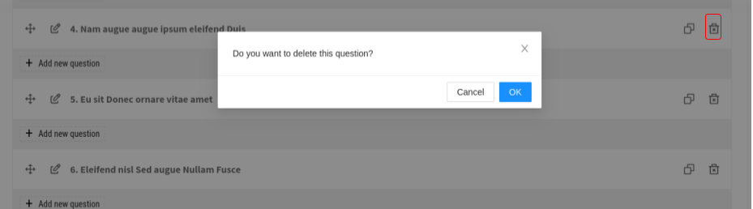

Overview
--------

Each question group has an array of questions that has a:

- name: string
- questionGroupId: number
- id: number
- order
- type: any(example: number, input, cascade, text, date, etc)
- tooltip
- required: can be either true or false

Add
---
You can add a new question by clicking on the *ADD NEW QUESTION* button.

Edit
----

Setting
~~~~~~~

- The question *name* can be updated by replacing the default name on an input field.
- The question *type* is updatable by selecting one of the types on a dropdown.
- A *variable name* can be added by filling an input text.
- You can fill the question *tooltip*.
- If you'd love to set a question as required, checking the required checkbox does so.
- Additionally, **double entry of an answer** can be required.
- You are also allowed to choose either hide of show string/password.
- Once editing is done, options are for you, cancelling or saving your updates.

Skip Logic
~~~~~~~~~~

- This Skip logic has two dropdowns that are selectable:
  
  - Dependent to question which can be deleted by clicking on the **trash** icon.
  - Logic.

- There is input that you can fill to add a value.
- Then, you can choose to either **Save** or **Cancle** or updates.

Dependent questions
-------------------

Once a dependent question is added, a list of dependencies are shown.

Copy
----

A question can be copied by clikin on the **COPY QUESTION HERE**

Delete
------

A question is deletable by clickon on the **Trash** icon.

